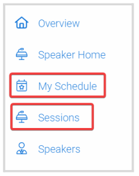
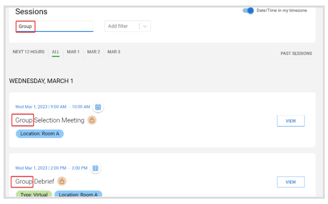
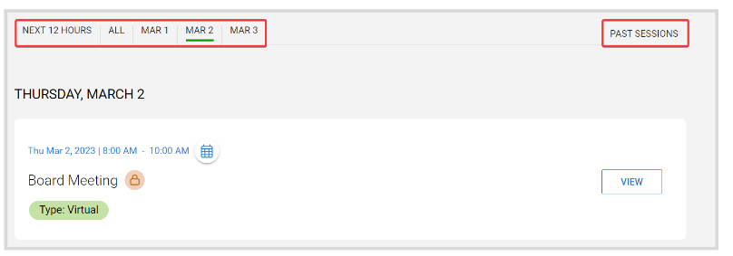
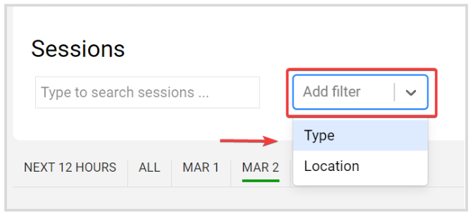
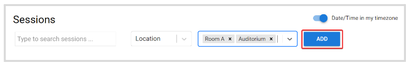
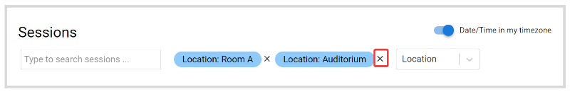

import { shareArticle } from '../../../components/share.js';
import { FaLink } from 'react-icons/fa';
import { ToastContainer, toast } from 'react-toastify';
import 'react-toastify/dist/ReactToastify.css';

export const ClickableTitle = ({ children }) => (
    <h1 style={{ display: 'flex', alignItems: 'center', cursor: 'pointer' }} onClick={() => shareArticle()}>
        {children} 
        <FaLink size="0.6em" />
    </h1>
);

<ToastContainer />

<ClickableTitle>Filter Event Sessions</ClickableTitle>

You can easily locate sessions of your interest, by searching sessions by name, date or adding filters from the **My Schedule**tab for sessions that you previously selected/registered or the **Sessions** tab for all event sessions

## Name

You can type the full session name, or a word(s) to locate a session(s) related

## Date

Predefined dates of the event will be available for you to filter, additionally, you can set to view sessions to take place Next 12 hours, All or Past Sessions

## Filter

Add filter criteria to display only related sessions. Click the **Filter field** to display a drop-down menu with the available categories

Select the desired criteria, and click **Add**

****

**Note:** You can add as many categories as you want

You can remove any filter criteria, by clicking the **X** next to it.

