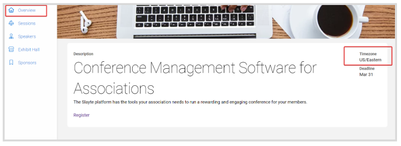
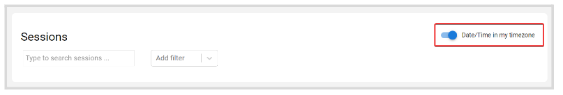

import { shareArticle } from '../../../components/share.js';
import { FaLink } from 'react-icons/fa';
import { ToastContainer, toast } from 'react-toastify';
import 'react-toastify/dist/ReactToastify.css';

export const ClickableTitle = ({ children }) => (
    <h1 style={{ display: 'flex', alignItems: 'center', cursor: 'pointer' }} onClick={() => shareArticle()}>
        {children} 
        <FaLink size="0.6em" />
    </h1>
);

<ToastContainer />

<ClickableTitle>How To Set Sessions In Your Time Zone</ClickableTitle>

Administrators are able to set a specific Timezone for an event. You have the option to show sessions in their original timezone, or you can enable sessions to show the Date/Time in your Timezone instead.

1. From the Home Page, go to **Events** and click the desired event tile  
2. You can confirm the event Timezone by going to the **Overview** Tab from the left panel

  
3. To update, click the **Sessions** or **My Schedule** tab  
4. Toggle ON/OFF **Date/Time in my Timezone** to automatically switch the timezone

