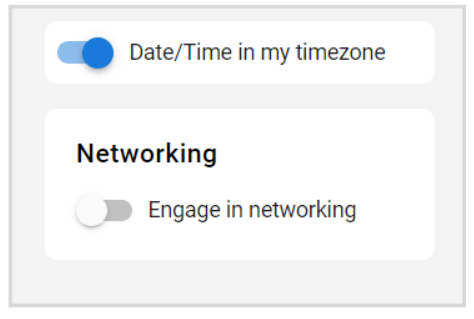
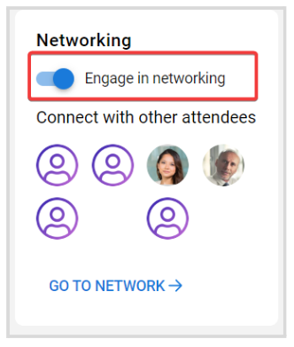
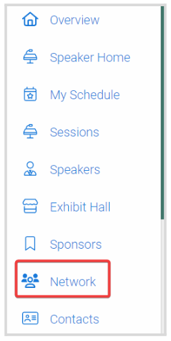
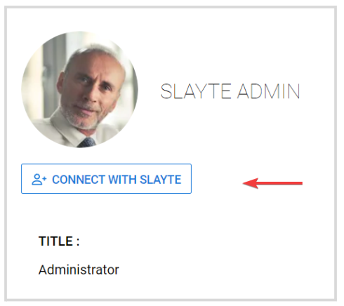

import { shareArticle } from '../../../components/share.js';
import { FaLink } from 'react-icons/fa';
import { ToastContainer, toast } from 'react-toastify';
import 'react-toastify/dist/ReactToastify.css';

export const ClickableTitle = ({ children }) => (
    <h1 style={{ display: 'flex', alignItems: 'center', cursor: 'pointer' }} onClick={() => shareArticle()}>
        {children} 
        <FaLink size="0.6em" />
    </h1>
);

<ToastContainer />

<ClickableTitle>How to Engage in Networking</ClickableTitle>

You can have the opportunity to connect with other attendees of the event, by enabling Networking. Find below the steps to follow: 

1. From the event **Overview**, on the right side; scroll down to locate the **Networking** section

2. To enable/disable, toggle **ON/OFF**

3. Once enabled, a **Network** tab will be added on your left panel

4. From here, you can search by name or browse by scrolling down to all attendees. Click the attendee's tile for more profile details, and you can also send an invitation by clicking the **Connect With** icon

