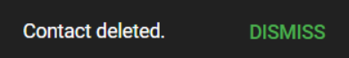

import { shareArticle } from '../../../components/share.js';
import { FaLink } from 'react-icons/fa';
import { ToastContainer, toast } from 'react-toastify';
import 'react-toastify/dist/ReactToastify.css';

export const ClickableTitle = ({ children }) => (
    <h1 style={{ display: 'flex', alignItems: 'center', cursor: 'pointer' }} onClick={() => shareArticle()}>
        {children} 
        <FaLink size="0.6em" />
    </h1>
);

<ToastContainer />

<ClickableTitle>Manage Event Contacts</ClickableTitle>

All accepted connections request will be automatically added to your Contacts. You can Accept/Decline invitations, chat, and review their profile. Follow the steps below:

1. From the Home Page, go to **Events** and click the desired event tile   
2. Click the **Contacts** tab from the left panel

## Pending Invite

An alert bar will display on top of the Contact list, whenever you have a pending invitation. From here you can **Accept/Decline** or **View Message** from the requestor

Click any of the above options, and from the pop-up window complete the action to **Connect/ Reject** 

## Search Contacts

You can search contacts by name from the search bar. To the right of each contact, you can **View Profile** or start **Chat**

****

## Delete Contact

If you no longer what to have a person as a contact, you can remove the connection.   
1. Locate the contact from the list   
2. Click the **ellipsis** icon to the right   
3. Select **Remove from My Contacts**

  
4. Click **Yes** to confirm

   
5. You will receive the following confirmation message

