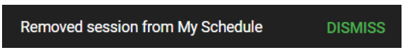

import { shareArticle } from '../../../components/share.js';
import { FaLink } from 'react-icons/fa';
import { ToastContainer, toast } from 'react-toastify';
import 'react-toastify/dist/ReactToastify.css';

export const ClickableTitle = ({ children }) => (
    <h1 style={{ display: 'flex', alignItems: 'center', cursor: 'pointer' }} onClick={() => shareArticle()}>
        {children} 
        <FaLink size="0.6em" />
    </h1>
);

<ToastContainer />

<ClickableTitle>Remove Sessions From My Schedule</ClickableTitle>

When you no longer would like to attend or be part of a previously enrolled session, you can easily remove it from your schedule to free this time for another session, if desired.

1. From the Home page, go to **Events** and click the desired event tile  
2. Click **My Schedule** from the left panel

   
3. You can search the session by name or filter, and once located click **View**

   
4. On the right top corner of the session title bar, click **Remove from My schedule**

****

5. Click **Yes** to continue

6. You will receive the following confirmation message

