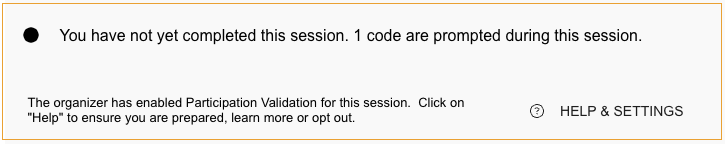
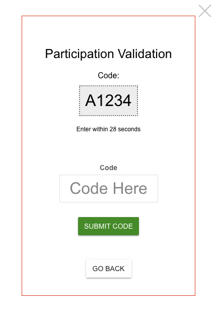

import { shareArticle } from '../../../components/share.js';
import { FaLink } from 'react-icons/fa';
import { ToastContainer, toast } from 'react-toastify';
import 'react-toastify/dist/ReactToastify.css';

export const ClickableTitle = ({ children }) => (
    <h1 style={{ display: 'flex', alignItems: 'center', cursor: 'pointer' }} onClick={() => shareArticle()}>
        {children} 
        <FaLink size="0.6em" />
    </h1>
);

<ToastContainer />

<ClickableTitle>Session Participation Verification</ClickableTitle>

During certain sessions, event organizers may need to confirm your active attendance. This validation method involves a pop-up code that appears on your screen at specific intervals. The objective is to ensure participants are attentively involved throughout the session.

The number of prompts that will be displayed under a specific session will be displayed below the video feed is being played when available:

 

## How Does it Work?

**1. Code Prompt**: At designated times during a session, a chime will sound and a pop-up will appear on your screen. This pop-up will prompt you to enter a unique code that's displayed on your screen.   

**2. Code Entry**: You must enter the correct code within a 30-second window. Doing so will mark you as present for that particular checkpoint in the session.

**3. Missed or Incorrect Code**: Be careful with your entries. If you miss a code or enter an incorrect code three times consecutively, you will not be marked as having attended the session.

## Preparation for Participation Verification

Here's what you need to ensure for successful participation verification:

1. **Browser Permissions**: Ensure that your browser has permission to play audio. This is important because a chime sound accompanies the code prompt. To enable sound permissions, follow the guides specific to your browser:

	* [Google Chrome](https://support.google.com/chrome/answer/114662?hl=en)
	* [Mozilla Firefox](https://support.mozilla.org/en-US/kb/what-to-do-if-firefox-wont-play-any-sounds)
	* [Safari](https://support.apple.com/guide/safari/mute-audio-in-tabs-ibrwae910b47/16.1/mac/13.0)
	* [Microsoft Edge](https://support.microsoft.com/en-us/windows/fix-sound-or-audio-problems-in-windows-73025246-b61c-40fb-671a-2535c7cd56c8)
2. **Volume Check**: Ensure that your device's volume is turned up so that you can hear the chime. You can test your sound below by clicking on “Test Sound”.
3. **Test Code Check:** You can click the “Test Code” to have a real sample of how the code verification will operate, so you are prepared on what to expect.
4. **Stay on the Page**: Once the session starts, do not leave or reload the page. Doing so may disrupt the verification process and may affect your attendance mark.

