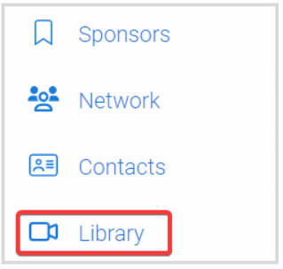
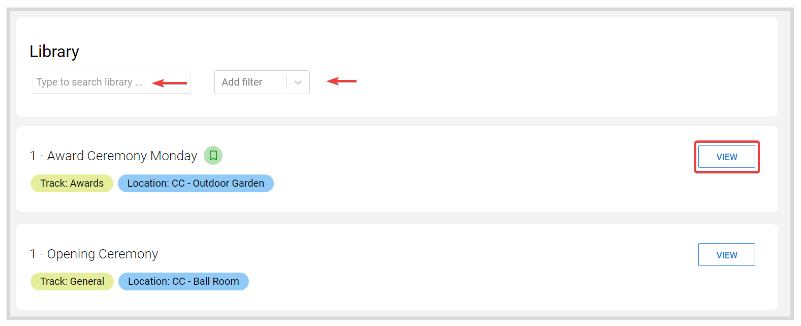
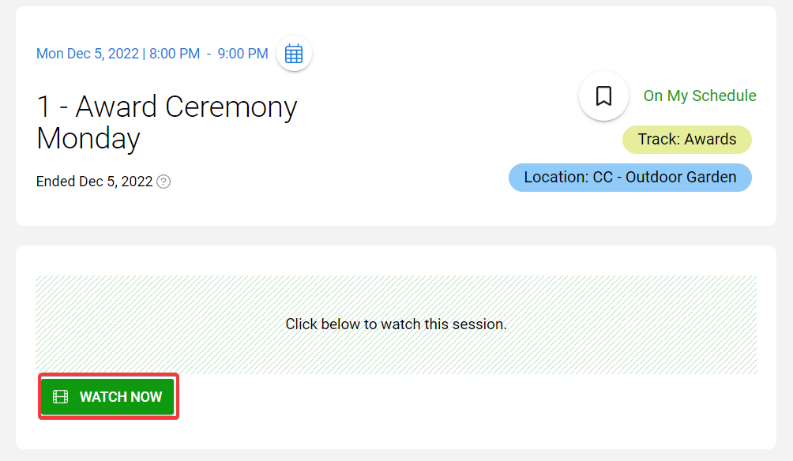

import { shareArticle } from '../../../components/share.js';
import { FaLink } from 'react-icons/fa';
import { ToastContainer, toast } from 'react-toastify';
import 'react-toastify/dist/ReactToastify.css';

export const ClickableTitle = ({ children }) => (
    <h1 style={{ display: 'flex', alignItems: 'center', cursor: 'pointer' }} onClick={() => shareArticle()}>
        {children} 
        <FaLink size="0.6em" />
    </h1>
);

<ToastContainer />

<ClickableTitle>Sessions Library</ClickableTitle>

When enabled by the Administrator, you can have access to enrolled sessions with on-demand video content throughout the course of the event and not only for the length of the session. To find these sessions, follow these steps:

1. Go to **Events**, and click the desired event tile  
2. Click **Library** from the left panel

3. You can **search** sessions by **Name** or apply a **filter**. Click **View** to the right to access session details

4. On the session page, you will have access to all content, even when the session has ended

