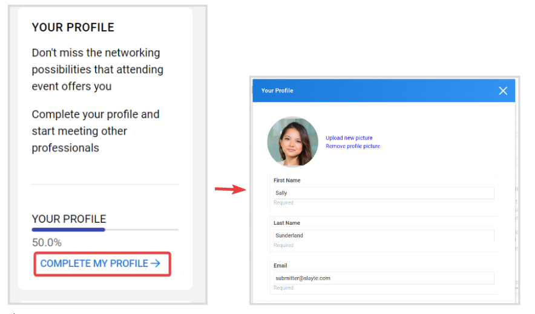
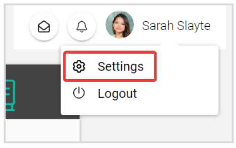

import { shareArticle } from '../../../components/share.js';
import { FaLink } from 'react-icons/fa';
import { ToastContainer, toast } from 'react-toastify';
import 'react-toastify/dist/ReactToastify.css';

export const ClickableTitle = ({ children }) => (
    <h1 style={{ display: 'flex', alignItems: 'center', cursor: 'pointer' }} onClick={() => shareArticle()}>
        {children} 
        <FaLink size="0.6em" />
    </h1>
);

<ToastContainer />

<ClickableTitle>Update Your Profile</ClickableTitle>

For everybody that is involved in the event to see the most accurate contact information and details about you, ensure your Profile is updated. Keep in mind, publicly visible fields will be determined by the event Administrator. 

You can update your profile from the below options:

1. From the **Event Overview** tab, on the right side, locate the **Your Profile** section. Click **Complete My Profile** to add/update from the pop-up window. 

2. Click **your name** in the upper right corner of the whole window, and click **Settings** for the same profile pop-up window to open to update your information. 

When ready, select **SAVE** to complete the change(s)

