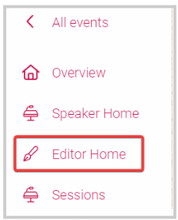

import { shareArticle } from '../../../components/share.js';
import { FaLink } from 'react-icons/fa';
import { ToastContainer, toast } from 'react-toastify';
import 'react-toastify/dist/ReactToastify.css';

export const ClickableTitle = ({ children }) => (
    <h1 style={{ display: 'flex', alignItems: 'center', cursor: 'pointer' }} onClick={() => shareArticle()}>
        {children} 
        <FaLink size="0.6em" />
    </h1>
);

<ToastContainer />

<ClickableTitle>Edit Session Details</ClickableTitle>

As an Editor or part of an Editor's group, you will be assigned sessions, for which you will be required to manage or edit as needed.

1. Go to the desired event 

2. From the left panel, click **Editor Home** 

3. From here you can **search sessions** by name or **filter** them by category 

Or **Add Them to Your Own Calendar**by clicking the calendar icon next to the session title. You have the following options (Google, Apple (iCalendar/ics), Outlook, Outlook 365 and Yahoo)

4. Locate the session, and click **View**

5. Next to the session's title, Click **Manage Session**

6. From the pop-up window, click the **Edit session** tab to display the available fields to modify 

7. Click **Update** to complete the changes

Note: From the Manage Session window, you can also view the following information: 

* Specific instructions from the Administrator
* Session Information
* Speakers for that session
* List of attendees to the session
* Statistics, which includes the enrolled attendees' list

