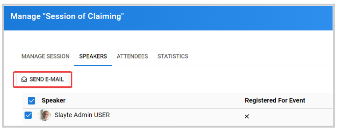
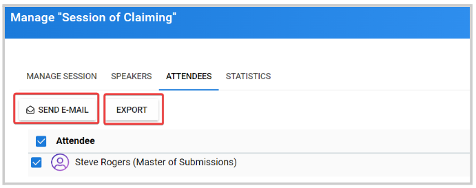

import { shareArticle } from '../../../components/share.js';
import { FaLink } from 'react-icons/fa';
import { ToastContainer, toast } from 'react-toastify';
import 'react-toastify/dist/ReactToastify.css';

export const ClickableTitle = ({ children }) => (
    <h1 style={{ display: 'flex', alignItems: 'center', cursor: 'pointer' }} onClick={() => shareArticle()}>
        {children} 
        <FaLink size="0.6em" />
    </h1>
);

<ToastContainer />

<ClickableTitle>Email Speakers or Attendees as Editor</ClickableTitle>

1. From the desired event, click **Editor Home**

2. Click **View** to the right of the Session Title

3. Click **Manage Session** 

## Speakers

Click the **Speaker's** **Tab** to display the complete list. From here you can select some or all, and send a message by clicking the **Send Email** button 

Once done writing the message, click **Send**

## Attendee

Go to the **Attendee's tab**, to display the complete list. For Attendees, you can send a message by clicking  **Send Email** or **Export**to receive an email with the list of attendees

