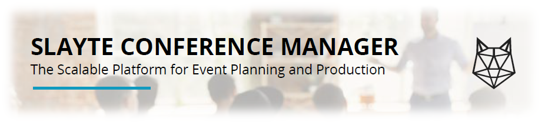

import { shareArticle } from '../../../components/share.js';
import { FaLink } from 'react-icons/fa';
import { ToastContainer, toast } from 'react-toastify';
import 'react-toastify/dist/ReactToastify.css';

export const ClickableTitle = ({ children }) => (
    <h1 style={{ display: 'flex', alignItems: 'center', cursor: 'pointer' }} onClick={() => shareArticle()}>
        {children} 
        <FaLink size="0.6em" />
    </h1>
);

<ToastContainer />

<ClickableTitle>About Slayte Conference Manager</ClickableTitle>

The Slayte Conference Manager is available in five tiers. At its simplest, administrators can arrange sessions into a conference calendar. The platform administrators can even publish and distribute a PFD of said calendar. Tier five provides full capabilities for attendees, speakers, sponsors, exhibitors and administrators to patriate in a world-class event with pre-recorded and live session, private and group chats, interactive booths and our proprietary back-stage chat that lets administrators coordinate with presenters around the world.

