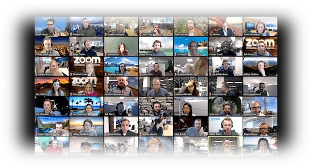

import { shareArticle } from '../../../components/share.js';
import { FaLink } from 'react-icons/fa';
import { ToastContainer, toast } from 'react-toastify';
import 'react-toastify/dist/ReactToastify.css';

export const ClickableTitle = ({ children }) => (
    <h1 style={{ display: 'flex', alignItems: 'center', cursor: 'pointer' }} onClick={() => shareArticle()}>
        {children} 
        <FaLink size="0.6em" />
    </h1>
);

<ToastContainer />

<ClickableTitle>Tier 2 - Public Program</ClickableTitle>

****

**Administrators Can Plan the Conference**

* Administrators can create sessions and assign speakers
* Administrators can Import sessions from Slayte Submission Manager or CSV
* Administrators can export sessions to Impexium or CSV

**The Public Can Browse the Conference**

* The public can visit the conference website
* The public can browse the conference schedule and speaker list
* Administrators can embed the conference schedule and speaker list onto any website via widgets

