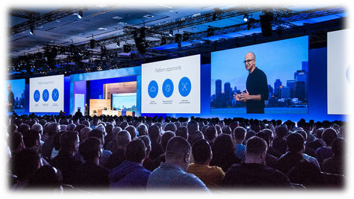

import { shareArticle } from '../../../components/share.js';
import { FaLink } from 'react-icons/fa';
import { ToastContainer, toast } from 'react-toastify';
import 'react-toastify/dist/ReactToastify.css';

export const ClickableTitle = ({ children }) => (
    <h1 style={{ display: 'flex', alignItems: 'center', cursor: 'pointer' }} onClick={() => shareArticle()}>
        {children} 
        <FaLink size="0.6em" />
    </h1>
);

<ToastContainer />

<ClickableTitle>Tier 5 - Interactive Participation</ClickableTitle>

****

**Administrators Can Plan the Conference**

* Administrators can create sessions and assign speakers
* Administrators can Import sessions from Slayte Submission Manager or CSV
* Administrators can export sessions to Impexium or CSV

**The Public Can Browse the Conference**

* The public can visit the conference website
* The public can browse the conference schedule and speaker list
* Administrators can embed the conference schedule and speaker list onto any website via widgets

**Attendees Can Customize Their Personalized Schedules**

* Attendees can register and login to the conference
* Attendees can browse the session schedule and speaker list
* Attendees can add sessions to their personal schedules
* Attendees can download appointments for their selected sessions to their personal calendars

**Attendees Can Watch On-Demand Content and Visit Exhibitor Booths and Sponsor Pages**

* Attendees can watch pre-recorded sessions in an on-demand Library
* Attendees can download documents from on-demand sessions
* Administrators can set up exhibitor’s booths and sponsor pages
* Administrators can create sponsor ads and place them on designated sessions
* Administrators can add custom pages to the conference web site

**All Stakeholders Can Participate in a Live Interactive Conference with Self Service Portals and Real-Time Chats**

* Attendees can join live sessions
* Attendees can network with speakers and other attendees through private and group chats
* Attendees can edit and share the personal profiles
* Speakers can use a self-service portal to manage their sessions
* Exhibitors and sponsors can use a self-service portal to design their booths and pages
* Exhibitors can capture leads and interact with attendees through chat
* Exhibitors can view statistics and download reports
* Administrators and presenters can communicate via backstage chat
* Administrators can view conference statistics and publish conference reports

