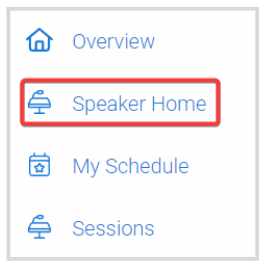
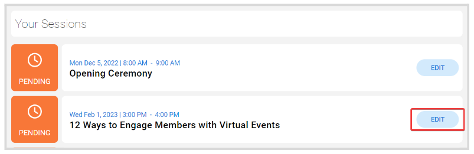
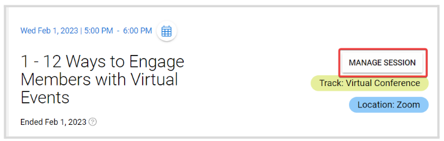
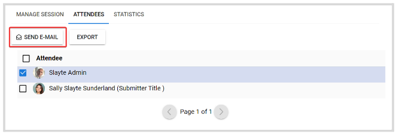

import { shareArticle } from '../../../components/share.js';
import { FaLink } from 'react-icons/fa';
import { ToastContainer, toast } from 'react-toastify';
import 'react-toastify/dist/ReactToastify.css';

export const ClickableTitle = ({ children }) => (
    <h1 style={{ display: 'flex', alignItems: 'center', cursor: 'pointer' }} onClick={() => shareArticle()}>
        {children} 
        <FaLink size="0.6em" />
    </h1>
);

<ToastContainer />

<ClickableTitle>Communicate With Your Session Attendees</ClickableTitle>

As a Speaker, you can send emails to some or all attendees registered for your session; to either share additional information, insights, updates, etc.; by following these steps:

1. From the desired event, click **Speaker Home**

  
2. Locate the session, and click **Edit** to the right

  
3. Click **Manage session**

****

4. From the pop-up window, click the **Attendees** tab   
5. Click the checkbox to select the attendees to email, and click **Send E-Mail**

   
6. Once agree with the message, click **Send**

