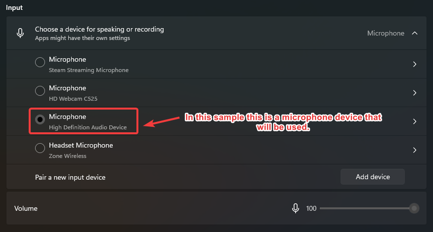

import { shareArticle } from '../../../components/share.js';
import { FaLink } from 'react-icons/fa';
import { ToastContainer, toast } from 'react-toastify';
import 'react-toastify/dist/ReactToastify.css';

export const ClickableTitle = ({ children }) => (
    <h1 style={{ display: 'flex', alignItems: 'center', cursor: 'pointer' }} onClick={() => shareArticle()}>
        {children} 
        <FaLink size="0.6em" />
    </h1>
);

<ToastContainer />

<ClickableTitle>Configuring your Microphone and Speakers in your Operating System</ClickableTitle>

## Configuring Audio Devices in your Operating System

Before configuring Zoom/Slayte event, it is important for you to verify that the in/out put devices are present in the system, if they have not been recognized by Windows/Mac OS, they will not be available for use:

**Windows:**

1. Open the start menu, search for **Sound Settings** then you will be redirected to the page  

	* Under Output, select the device where the sound will be coming from
	* Under Input, choose the device that corresponds to the microphone device that will be used

*For further details, please review the following Microsoft Help Center article: **[How to Set Up and Test your Microphone](https://support.microsoft.com/en-us/windows/how-to-set-up-and-test-microphones-in-windows-ba9a4aab-35d1-12ee-5835-cccac7ee87a4#ID0EDD=Windows_10)***

 

**Mac OS:**

1. On your Mac, select **Apple Menu** > **System Preferences**, select **Sound**, then **Input**
2. Select the desired device in the list of sound input devices
3. All sound input devices available to your Mac will be listed. If your display has an internal microphone, it’s listed as “Display Audio.”

*For further details, please review the following Apple Help Center article: **[Selecting your Input Device on Mac OS.](https://support.apple.com/guide/mac-help/change-the-sound-input-settings-mchlp2567/mac)***

