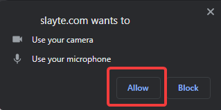
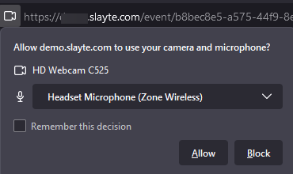
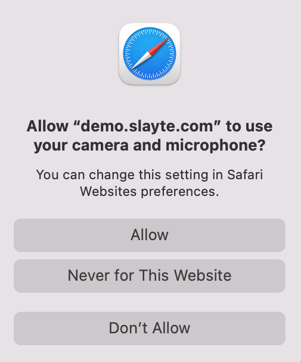

import { shareArticle } from '../../../components/share.js';
import { FaLink } from 'react-icons/fa';
import { ToastContainer, toast } from 'react-toastify';
import 'react-toastify/dist/ReactToastify.css';

export const ClickableTitle = ({ children }) => (
    <h1 style={{ display: 'flex', alignItems: 'center', cursor: 'pointer' }} onClick={() => shareArticle()}>
        {children} 
        <FaLink size="0.6em" />
    </h1>
);

<ToastContainer />

<ClickableTitle>Delivering a Successful Virtual Session by Ensuring your System is Fully Prepared</ClickableTitle>

The delivery of a virtual session as a speaker relies a lot on the stage preparation. Besides the content that will be delivered it also relies on ensuring your input devices are properly configured.

We will cover how to properly configure your input devices to ensure that a successful session is delivered to your audience.

For Zoom itself, we recommend the following official article: **[https://support.zoom.us/hc/en-us/articles/201362283-Testing-audio-before-Zoom-Meetings](https://support.zoom.us/hc/en-us/articles/201362283-Testing-audio-before-Zoom-Meetings)**

### Ensure that your computer detects your audio devices.

The first step is to confirm and verify that your audio devices are properly detected and operating on your computer, as this can potentially cause issues during your session as a speaker during your virtual conference delivery.

This configuration varies depending on the type of system used, please check the following Help Center Article for instructions for your specific system type: **[https://sla.yt/system-audio-settings](https://sla.yt/system-audio-settings).**

### Allow your browser to access your audio devices

After joining or starting your session, your browser may ask you to allow use of your audio/camera devices. This is important for you as a speaker since the browser needs to make use of these devices to allow you to deliver your conference.

The dialog presented may vary by the web browser if either a button **Join** or **Start** will be presented in your session. (Depending as configured by the Event Host).

*Note: Specific Instructions may also be given by your Event Host.*

**Google Chrome/Microsoft Edge**

**Firefox:**

**Safari:**

If such dialogs are not presented, you can always review permissions by checking the browser configuration settings:

* [Google Chrome](https://support.google.com/chrome/answer/2693767?hl=en&co=GENIE.Platform%3DDesktop)
* [Firefox](https://support.mozilla.org/en-US/kb/how-manage-your-camera-and-microphone-permissions)
* [Microsoft Edge](https://support.microsoft.com/en-us/windows/windows-camera-microphone-and-privacy-a83257bc-e990-d54a-d212-b5e41beba857)
* [Safari](https://support.apple.com/en-kw/guide/safari/ibrwe2159f50/mac)

