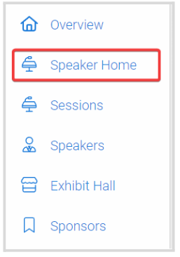
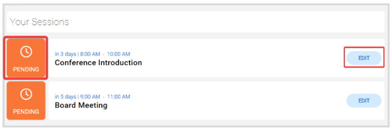
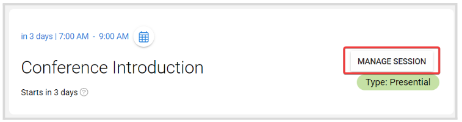
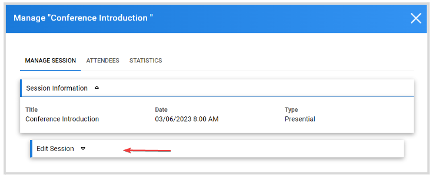
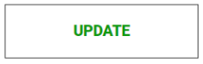
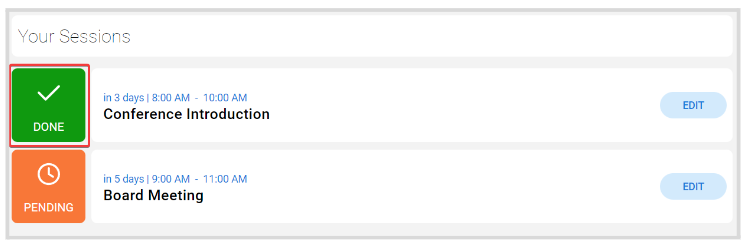

import { shareArticle } from '../../../components/share.js';
import { FaLink } from 'react-icons/fa';
import { ToastContainer, toast } from 'react-toastify';
import 'react-toastify/dist/ReactToastify.css';

export const ClickableTitle = ({ children }) => (
    <h1 style={{ display: 'flex', alignItems: 'center', cursor: 'pointer' }} onClick={() => shareArticle()}>
        {children} 
        <FaLink size="0.6em" />
    </h1>
);

<ToastContainer />

<ClickableTitle>Edit Your Assigned Sessions</ClickableTitle>

As Speaker, you can edit your sessions prior to taking place to fine-tune any details. Note, this option is only available if enabled by the Administrator; and may be restricted to certain fields only.  

Find below the steps to follow: 

1. From the Home Page, go to **Events** and click the desired event tile   
2. Click **Speaker Home**. Here you will find all sessions assigned to you

  
3. Click **Edit**

****

**Note:** A **Pending** status session means there is a required field that needs to be filled/updated on the session  
4. Click **Manage Session**

   
5. Click **Edit Session**, to display the available editable fields of the session

  
6. Once done, click **Update**

****

**Note:** Once all required fields are updated, the session status will be updated to **Done**

****

