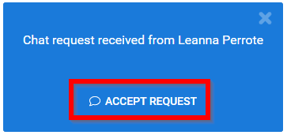
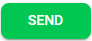

import { shareArticle } from '../../../components/share.js';
import { FaLink } from 'react-icons/fa';
import { ToastContainer, toast } from 'react-toastify';
import 'react-toastify/dist/ReactToastify.css';

export const ClickableTitle = ({ children }) => (
    <h1 style={{ display: 'flex', alignItems: 'center', cursor: 'pointer' }} onClick={() => shareArticle()}>
        {children} 
        <FaLink size="0.6em" />
    </h1>
);

<ToastContainer />

<ClickableTitle>Accept Chat Request(s)</ClickableTitle>

As a Company Representative you will receive a pop up indicating a new chat request received from an attendee.

1. Accept the request by clicking on **ACCEPT REQUEST**

2. You will be able to **view the attendee's profile** before/during the chat interaction

3. Click within the text field then **begin typing**

4. When ready to send the chat message select **SEND**

 

