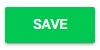

import { shareArticle } from '../../../components/share.js';
import { FaLink } from 'react-icons/fa';
import { ToastContainer, toast } from 'react-toastify';
import 'react-toastify/dist/ReactToastify.css';

export const ClickableTitle = ({ children }) => (
    <h1 style={{ display: 'flex', alignItems: 'center', cursor: 'pointer' }} onClick={() => shareArticle()}>
        {children} 
        <FaLink size="0.6em" />
    </h1>
);

<ToastContainer />

<ClickableTitle>Add Link</ClickableTitle>

Exhibitor/Sponsor URL to display the link below the **About** section.

1. Navigate to the Company Portal **Info** from the left pane

2. Type/Paste URL in the **Link** field

3. Scroll down to select **SAVE** before leaving page

Please note, you will also be able to white label the link to a link title, please click **[here](https://docs-for-customers.slayte.com/hc/en-us/articles/4495112369043)** for more details.

