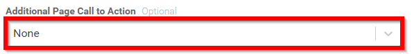
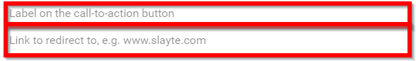
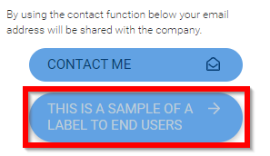

import { shareArticle } from '../../../components/share.js';
import { FaLink } from 'react-icons/fa';
import { ToastContainer, toast } from 'react-toastify';
import 'react-toastify/dist/ReactToastify.css';

export const ClickableTitle = ({ children }) => (
    <h1 style={{ display: 'flex', alignItems: 'center', cursor: 'pointer' }} onClick={() => shareArticle()}>
        {children} 
        <FaLink size="0.6em" />
    </h1>
);

<ToastContainer />

<ClickableTitle>Additional Page Call to Action - Creating Labels</ClickableTitle>

1. Navigate to the Company Portal **Info** from the left pane

2. Navigate to the **Additional Page Call to Action** section select **None** to expand the drop down menu

3. When selecting option from None to **Redirect** to link fill in fields

* Label on the call-to-action button
* Link to redirect to

Sample of Use:

