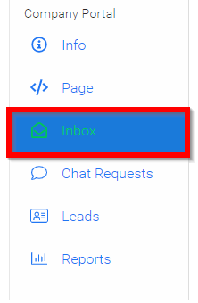
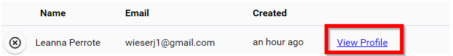
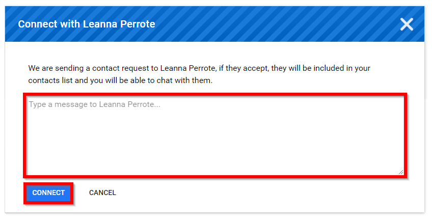

import { shareArticle } from '../../../components/share.js';
import { FaLink } from 'react-icons/fa';
import { ToastContainer, toast } from 'react-toastify';
import 'react-toastify/dist/ReactToastify.css';

export const ClickableTitle = ({ children }) => (
    <h1 style={{ display: 'flex', alignItems: 'center', cursor: 'pointer' }} onClick={() => shareArticle()}>
        {children} 
        <FaLink size="0.6em" />
    </h1>
);

<ToastContainer />

<ClickableTitle>Connect with Speakers/Attendee(s)</ClickableTitle>

From the [Leads](https://docs-for-customers.slayte.com/hc/en-us/articles/4495203182483-View-Leads) list you will have the option to chat with Speakers/Attendee(s).

1. Navigate to the Company Portal then select **Inbox**

2. Select **View Profile**

****

3. Select **CONNECT WITH USER's NAME** button

4. Type in the **body of your message** then select **CONNECT**

****

