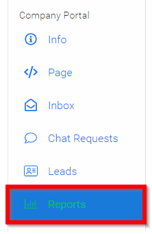
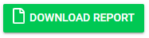

import { shareArticle } from '../../../components/share.js';
import { FaLink } from 'react-icons/fa';
import { ToastContainer, toast } from 'react-toastify';
import 'react-toastify/dist/ReactToastify.css';

export const ClickableTitle = ({ children }) => (
    <h1 style={{ display: 'flex', alignItems: 'center', cursor: 'pointer' }} onClick={() => shareArticle()}>
        {children} 
        <FaLink size="0.6em" />
    </h1>
);

<ToastContainer />

<ClickableTitle>Download Report(s)</ClickableTitle>

1. From the Company Portal select Reports

2. Scroll down past your on-demand reporting

3. Select **DOWNLOAD REPORT**

4. **Select** which report you would like to download which will be emailed to you in a .csv file

* Downloads - Will download all files
* Leads
* Chats
* Visitors

