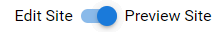
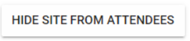
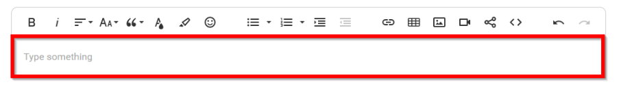
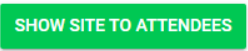

import { shareArticle } from '../../../components/share.js';
import { FaLink } from 'react-icons/fa';
import { ToastContainer, toast } from 'react-toastify';
import 'react-toastify/dist/ReactToastify.css';

export const ClickableTitle = ({ children }) => (
    <h1 style={{ display: 'flex', alignItems: 'center', cursor: 'pointer' }} onClick={() => shareArticle()}>
        {children} 
        <FaLink size="0.6em" />
    </h1>
);

<ToastContainer />

<ClickableTitle>Edit /Preview Company Page</ClickableTitle>

When needing to view your Company page, it may be best to preview as the attendees. 

1. Navigate to the **Company Portal** section from the left panel and click **Page**. Please note, this is what the page will look like to administrators and attendees. 

2. Slide toggle to **Preview Site**or **Edit Site**

3. This will allow you to make changes to the company site and during the editing, while the conference is live you may want/need to hide your site from attendees. To do this, select the **HIDE SITE FROM ATTENDEES** button.

4. Add additional details for your site. This information will be displayed to attendees below the Company Logo and Tagline. Please note, as a company administrator/representative, you will have the option to use enriched text and much more for adding a company description. 

5. Click **Save**

After making changes, you will be able to **SHOW SITE TO ATTENDEES** by selecting the button

