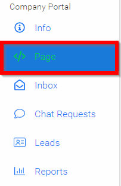
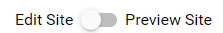
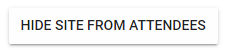
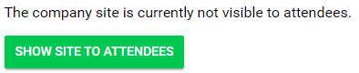

import { shareArticle } from '../../../components/share.js';
import { FaLink } from 'react-icons/fa';
import { ToastContainer, toast } from 'react-toastify';
import 'react-toastify/dist/ReactToastify.css';

export const ClickableTitle = ({ children }) => (
    <h1 style={{ display: 'flex', alignItems: 'center', cursor: 'pointer' }} onClick={() => shareArticle()}>
        {children} 
        <FaLink size="0.6em" />
    </h1>
);

<ToastContainer />

<ClickableTitle>Edit Site/Preview Site</ClickableTitle>

1. Select **Page** 

2. Slide toggle to **Edit Site**

This will allow you to make changes to the company site and during the editing while the conference is live you may want/need to hide your site from attendees. To do this, select the **HIDE SITE FROM ATTENDEES** button.

After making changes you will be able to **SHOW SITE TO ATTENDEES** by selecting the button

