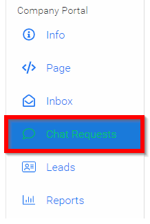
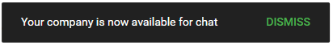

import { shareArticle } from '../../../components/share.js';
import { FaLink } from 'react-icons/fa';
import { ToastContainer, toast } from 'react-toastify';
import 'react-toastify/dist/ReactToastify.css';

export const ClickableTitle = ({ children }) => (
    <h1 style={{ display: 'flex', alignItems: 'center', cursor: 'pointer' }} onClick={() => shareArticle()}>
        {children} 
        <FaLink size="0.6em" />
    </h1>
);

<ToastContainer />

<ClickableTitle>Enable/Disable Chat Availability</ClickableTitle>

Need to set yourself away from the live chat? As a Company Representative you will have the ability to turn the chat on and off as needed during the live conference.

1. From the left pane select **Chat Requests**

2. **Slide the toggle** to enable chat attendees can request to chat with your Company/Representatives.

3. **Dismiss** the notification

Please note, to set yourself away turn the chat off. Your chat requests will be provided to you in your Inbox./*/*

