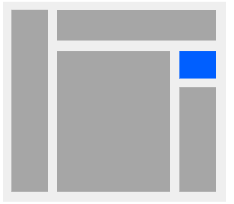
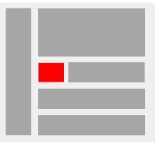
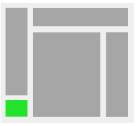

import { shareArticle } from '../../../components/share.js';
import { FaLink } from 'react-icons/fa';
import { ToastContainer, toast } from 'react-toastify';
import 'react-toastify/dist/ReactToastify.css';

export const ClickableTitle = ({ children }) => (
    <h1 style={{ display: 'flex', alignItems: 'center', cursor: 'pointer' }} onClick={() => shareArticle()}>
        {children} 
        <FaLink size="0.6em" />
    </h1>
);

<ToastContainer />

<ClickableTitle>General Sponsorship Opportunities - Advertisements</ClickableTitle>

By adding sponsor banners to the overview section, they can gain more visibility and increase their exposure. If your administrator has requested that you supply your advertisements, this is the guide that you need to follow!

**Overview Ad** - You are being requested to provide a video link for your advertisement. If you add multiple advertisements with video to a session, one will randomly be picked and played when an attendee views the session.

**Navigation Ad** - You are being requested to provide a video link for your advertisement. If you add multiple advertisements with video to a session, one will randomly be picked and played when an attendee views the session.

**Sponsor Ad** - You are being requested to provide an advertisement image, best dimensions 300px x 200px. Images will be resized to cover. 

Sponsor Ads can be added on the following pages:

**Within a Session:** 

In the **Overview Page**:

On the **Navigation Bar**:

Please contact your administrator to request the placement of your sponsor advertisement.

