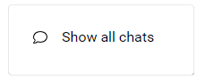
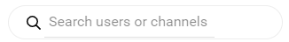

import { shareArticle } from '../../../components/share.js';
import { FaLink } from 'react-icons/fa';
import { ToastContainer, toast } from 'react-toastify';
import 'react-toastify/dist/ReactToastify.css';

export const ClickableTitle = ({ children }) => (
    <h1 style={{ display: 'flex', alignItems: 'center', cursor: 'pointer' }} onClick={() => shareArticle()}>
        {children} 
        <FaLink size="0.6em" />
    </h1>
);

<ToastContainer />

<ClickableTitle>Show All Chat Request(s)</ClickableTitle>

1. Select the **envelope** next to your profile name

2. Select **Show all chats**

****

3. You will be redirected to an **ALL Chats** page to interact with the on-demand interactions via Slayte Chat

4. You will be able to search by attendee's name or channels

5. On a per user basis you will have the ability to complete the following by selecting the ellipses (three dots) in the upper right corner of the attendees chat 

* Mute Channel
* Archive Channel
* Leave Channel

6. To show **archived channels** slide the toggle to enable

