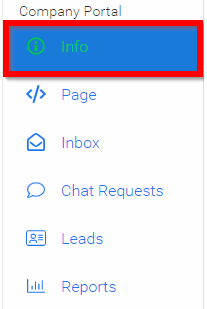

import { shareArticle } from '../../../components/share.js';
import { FaLink } from 'react-icons/fa';
import { ToastContainer, toast } from 'react-toastify';
import 'react-toastify/dist/ReactToastify.css';

export const ClickableTitle = ({ children }) => (
    <h1 style={{ display: 'flex', alignItems: 'center', cursor: 'pointer' }} onClick={() => shareArticle()}>
        {children} 
        <FaLink size="0.6em" />
    </h1>
);

<ToastContainer />

<ClickableTitle>Upload Logo Image</ClickableTitle>

1. Navigate to the Company Portal **Info** from the left pane

2. In the **logo field** either click in the Upload Image or drop image in field - Please note, recommended image is 100px x 100px, and to use transparent background png. Images will be resized to contain.

3. Scroll down to select **SAVE** before leaving page

