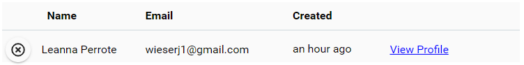

import { shareArticle } from '../../../components/share.js';
import { FaLink } from 'react-icons/fa';
import { ToastContainer, toast } from 'react-toastify';
import 'react-toastify/dist/ReactToastify.css';

export const ClickableTitle = ({ children }) => (
    <h1 style={{ display: 'flex', alignItems: 'center', cursor: 'pointer' }} onClick={() => shareArticle()}>
        {children} 
        <FaLink size="0.6em" />
    </h1>
);

<ToastContainer />

<ClickableTitle>View Leads</ClickableTitle>

Anytime an attendee/speaker selects your Contact Me label you will be able to view the information as Leads.

1. From the Company Portal select **Leads**

You will be provided with the following information:

* First and Last Name of User
* Email Address
* Created (date attendee selected Contact Me)
* Link to View User's Profile

Below is a *sample* of the list of **Leads**:

