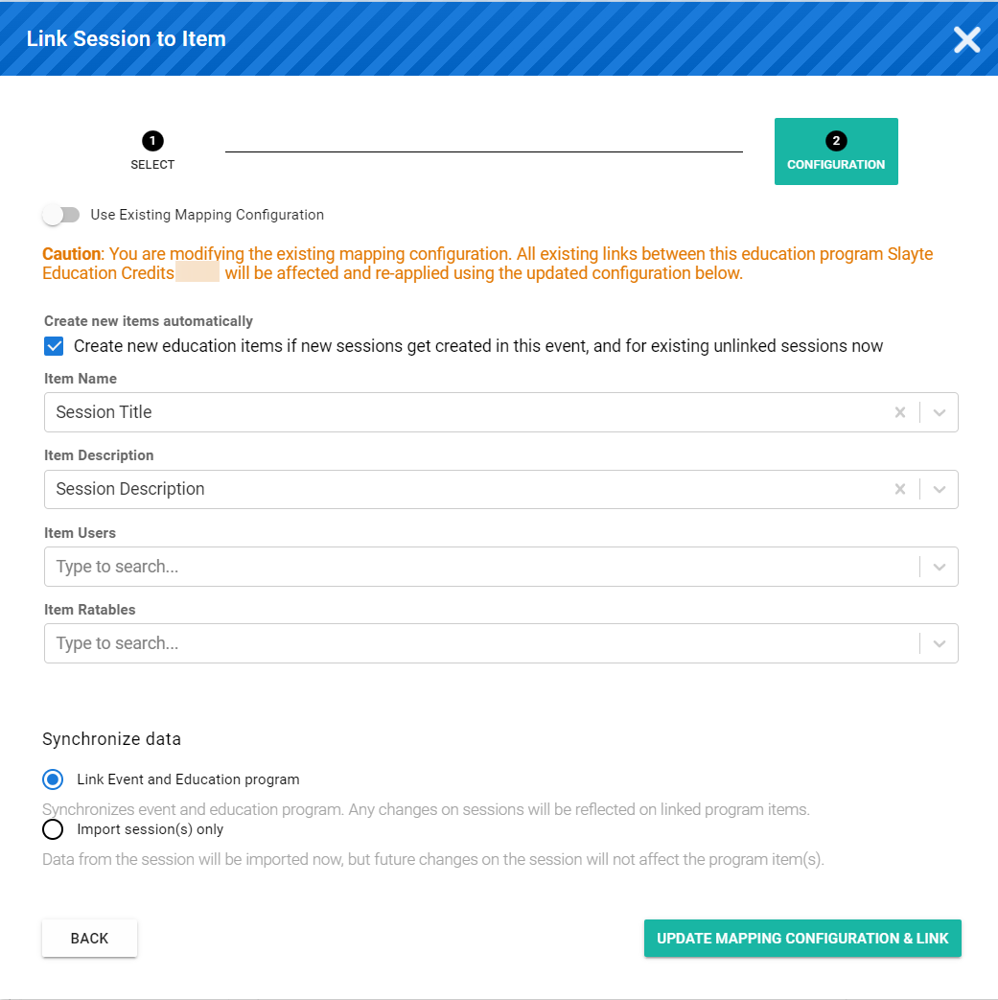

import { shareArticle } from '../../../components/share.js';
import { FaLink } from 'react-icons/fa';
import { ToastContainer, toast } from 'react-toastify';
import 'react-toastify/dist/ReactToastify.css';

export const ClickableTitle = ({ children }) => (
    <h1 style={{ display: 'flex', alignItems: 'center', cursor: 'pointer' }} onClick={() => shareArticle()}>
        {children} 
        <FaLink size="0.6em" />
    </h1>
);

<ToastContainer />

<ClickableTitle>Add Claimable Items to a Program</ClickableTitle>

Claimable Items are the credits users can claim in your Programs. Typical use-cases for Claimable Items are training certificates and confirming attendance at a seminar. 

## Creating a Claimable Item

1. Go to the **Homepage** and select **Education.**
2. Next to the **Program,** you would like to add **Claimable Items** to click View
3. Click on the **Claimable Items** tab
4. Click **Add Item** and populate the fields.
	1. Name Name of the item to be claimed.
	2. **(Optional if linking to an Event Session)** Description: Details of the item to be claimed
	3. **(Optional if Previously Enabled) Verification Template:** Specify a verification form to present to the users to verify their attendance. Eg: a questionnaire.
	4. **Credits**: Specify the credits provider for this claimable item.
	5. **(Optional if linking to an Event Session) Ratables:** Specify fields that will be rated for this session. Eg: Speaker's performance on a scale.
	6. **(Optional unless specific need for it) External ID:** An item's external ID is used to connect it to an external item, so that additional validations can be run linked to the external item, e.g. an Impexium session that must be attended by the claimer.

## Connecting a Claimable Item to a Session

1. On a previously created claimable item that you wish to link click **Edit**.
2. In the top right of the window, select the link to the session icon. 
3. Enter the name of the **Event** in the dialog.
4. Enter the name of the **Session** that the claimable item will be linked to, or select it from the list and click Next.
5. If doing for the first time, you will be presented with a dialog to map existing fields from the session to populate the claimable item.  

6. Choose how to synchronize data.
	* **Link to Event and Education Program (Recommended):** Will link both the claimable item to a session and will automatically connect data.
	* **Import Session(s) only:** This will only populate data from the fields in the session but not connect the session to the claimable item.
7. Select **Update Mapping Configuration** and link to confirm the changes.

*Note: Unless you need specific session mapping, the configuration will subsequently carry over to every claimable item that is linked to a session.*

## Bulk Update Credits

You also have the option to bulk update the credits in your Program. This allows you to update or add new credits from a .CSV file containing credits.

To begin:

1. Click **Bulk Update Credits**
2. Click **Download credits import template**
3. **Save** the file
4. Input the credit details you would like to import on the .CSV file
5. Click **Next**
6. Upload your updated .CSV file
7. Click **Upload**

/*Note: To import credits for the Claimable Items, the Credit name in the import-file needs to match exactly to the Credit name in one of the pre-configured Providers.

