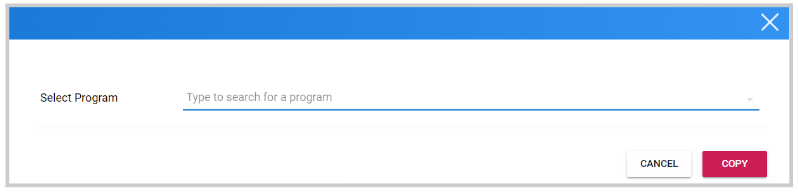
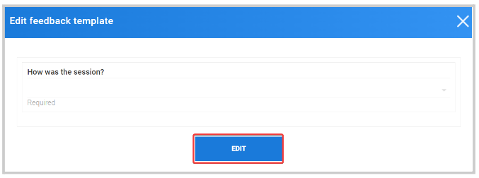

import { shareArticle } from '../../../components/share.js';
import { FaLink } from 'react-icons/fa';
import { ToastContainer, toast } from 'react-toastify';
import 'react-toastify/dist/ReactToastify.css';

export const ClickableTitle = ({ children }) => (
    <h1 style={{ display: 'flex', alignItems: 'center', cursor: 'pointer' }} onClick={() => shareArticle()}>
        {children} 
        <FaLink size="0.6em" />
    </h1>
);

<ToastContainer />

<ClickableTitle>Configure Feedback Template</ClickableTitle>

Feedback Templates will be filled in by users to complete their Claim for credit(s). These can be as simple or complex as required, a **minimum of one field** is required for end-users to claim credits.

## Creating Feedback Template

1. Go to the **Settings** Tab from the desired program
2. Click **Edit** at the bottom of the page
3. Locate the **Feedback** section, and click **Create** next to **Feedback Template**
4. Select **Add Field**

	* Add as many fields for the information to be collected as wished to
	* Select **View all field types**, for more options and detailed descriptions of their use
	* Select **Save** to commit the template configuration
5. Alternatively, you can also **Import** a Feedback Template from another program. Instead of **Create** click **Import,**search the program you are importing from by name, and click **Copy** 
6. **(Optional)** **Use Users →** This feature allows you to match a list of users to corresponding Feedback Templates each should fill out. Toggle this option if you would like to control which Template each Claimer fills in
7. **Items Label→** This will be the label attached to each claim
8. **Claim Label→** This will be the text added to the button that allows users to make a Claim in your program
9. **(Optional) Speaker Template→** Speaker Templates can be used to collect feedback on specific speakers who lead sessions
10. Select the **Save button** at the end of the page

## Edit Feedback Template

1. From the **Settings** Tab, click **Edit** at the bottom of the page
2. Go to the **Feedback** section and click **Edit** next to Feedback Template
3. From the pop-up window, click **Edit** again to start updating/adding or removing fields
4. Click **Save**at the bottom of the pop-up window
5. Then **Save** again, at the bottom of the main settings page

