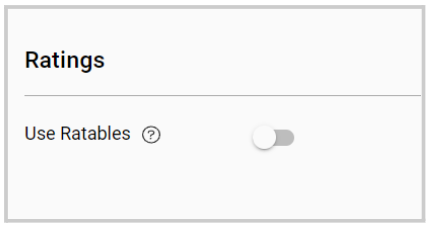
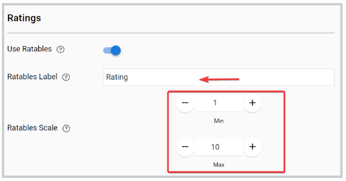

import { shareArticle } from '../../../components/share.js';
import { FaLink } from 'react-icons/fa';
import { ToastContainer, toast } from 'react-toastify';
import 'react-toastify/dist/ReactToastify.css';

export const ClickableTitle = ({ children }) => (
    <h1 style={{ display: 'flex', alignItems: 'center', cursor: 'pointer' }} onClick={() => shareArticle()}>
        {children} 
        <FaLink size="0.6em" />
    </h1>
);

<ToastContainer />

<ClickableTitle>Configure Ratings</ClickableTitle>

This feature allows you to collect feedback on the claimable items on your Educations Program on a rating scale.

1. From the desired program, click **View**   
2. Go to the **Settings** tab   
3. Click **Edit** at the bottom of the page   
4. Locate the **Ratings** section and toggle **ON** to enable

   
5. Once enabled, you can set the following:

* **Ratables Label:** this label will be used to refer to the ratables list when it's displayed
* **Ratables Scale:** assigns a value to the ratings in session education credit claim

/*/*Note: Ratables can be configured on a per-item basis when editing claimable items (On the "Claimable Items" tab)

