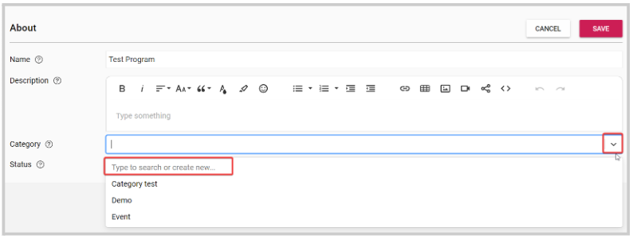
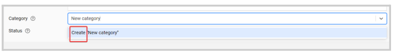
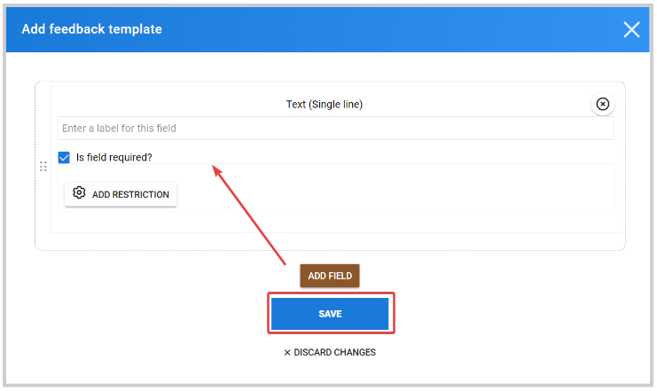

import { shareArticle } from '../../../components/share.js';
import { FaLink } from 'react-icons/fa';
import { ToastContainer, toast } from 'react-toastify';
import 'react-toastify/dist/ReactToastify.css';

export const ClickableTitle = ({ children }) => (
    <h1 style={{ display: 'flex', alignItems: 'center', cursor: 'pointer' }} onClick={() => shareArticle()}>
        {children} 
        <FaLink size="0.6em" />
    </h1>
);

<ToastContainer />

<ClickableTitle>Create a Claim Program</ClickableTitle>

Claim Programs allow users to claim for specific credits linked to assignments, certificates, or seminars they have completed. You can adjust which credits are added to your Program, how many credits can be claimed, and even add forms to gain feedback on Claimer experience.

## To set up a Claim Program

1. From the Homepage, select **Education**

2. Select the **Create New Program** button

## Configure **About** of the Program

1. Click the Edit button to customize the details presented externally to the credit claimers.
	* **Name**: Give a name to the program.
	* **Description**: Customize through a rich text editor the description presentation of the education programs.
	* **Category**: Categorize your program as desired. You can choose from already created categories or create a new one.

                 - From the **About** page, click in the Category field or drop-down arrow to the right to display the existing categories or the option to create a new one. 

        - Type the name you would like to assign and click **Create**

      2. Click **Save** to commit the changes.

Now that you have created your Claimable Program with a basic setup, you can customize a few settings to decide which credits should be claimable and how to verify completion.

1. Click on the **Settings** tab. This page controls how users can access the Claim Program and which information they will need to complete the claim.

2. Click **Edit** in the left bottom corner. 
3. Choose the **Beginning** and **End** dates for your Claim Program
4. Set any **User restrictions.** You can specify which users are allowed to claim from the program and its associated claim items. By default, this is set to **Anyone can claim,**click **+ Add Restriction** to personalize. 

## Feedback Template

Feedback Templates will be filled in by users to complete their Claim for credits. These can be as simple or complex as required, but at least one must be added to your Claim Program for users to claim credits.

To create a Feedback Template:

1. Click **Create** next to Feedback Template

2. Click **Add Field.** Fields allow you to add custom questions to the Claim form that users will fill in

3. Click **Save**

****

You have now successfully created a Feedback Template that users will fill in when claiming their credits.

**Use Users**: This feature allows you to match a list of users to corresponding Feedback Templates each should fill out. Toggle this option if you would like to control which Template each Claimer fills in.

**Items Label**: This will be the label attached to each claim

**Claim Label**: This will be the text added to the button that allows users to make a Claim in your program.

**Ratables**: These allow you to collect feedback ratings on certain items related to your Claimable Item e.g. session location.

**Verification**: This option allows you to add a few questions to your Feedback Template that Claimers will need to fill in correctly in order to complete the Claim. You can choose how many attempts each Claimer will have and also what the passing percentage score should be.

## Certification

Under this section, you can configure how certifications will be granted.

**Submit Behavior**: This decides how Claims will be submitted. You can choose whether the user should submit each Claim manually or submit Claims all at once after confirming.

**Submit Actions**: Here, you should specify the action type that will be performed once a claim is submitted.

**Admin Notification Emails**: Add a list of emails to be included for all notifications in this program.

**Provider certificate overrides**: This option allows you to override the default certificate template for the provider(s) in this program.

## Actions

At the bottom of the page, you can complete the following options on your Claim Programs:

**Copy Program**: This option allows you to duplicate your Claim Program, Feedback, and Speaker Templates. Claimable items however will not be duplicated, these will need to be re-added to each Claim Program. This is a useful feature for making multiple Claim Programs that vary slightly.

**Activate Claiming**: Once you activate a Program, users can make claims for credits. You will also need to ensure you have correctly set up the beginning and end dates for your Claim Program, and that the users fulfill any access restrictions added.

**Archive Program**: If you no longer require a Claim Program and would like to remove it from your main list, you can archive it to move it to the archived category and later delete it, if preferred.

**Delete Program:** This is an irreversible action and will remove the program and all related data.

