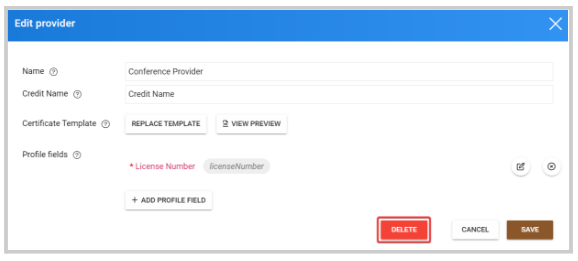

import { shareArticle } from '../../../components/share.js';
import { FaLink } from 'react-icons/fa';
import { ToastContainer, toast } from 'react-toastify';
import 'react-toastify/dist/ReactToastify.css';

export const ClickableTitle = ({ children }) => (
    <h1 style={{ display: 'flex', alignItems: 'center', cursor: 'pointer' }} onClick={() => shareArticle()}>
        {children} 
        <FaLink size="0.6em" />
    </h1>
);

<ToastContainer />

<ClickableTitle>Delete Credit Provider</ClickableTitle>

1. Go to **Educations**, and click the **Providers** tab 

2. Click **Edit** next to the provider you want to delete 

3. Click **Delete**

****

Note:   A **Provider** can't be deleted if it's been in used on a program. You will be required to first remove the provider from said program to then proceed to delete it. 

