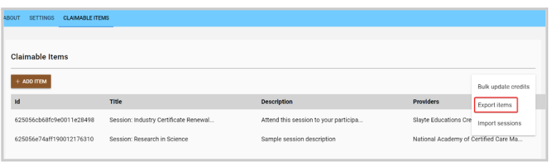

import { shareArticle } from '../../../components/share.js';
import { FaLink } from 'react-icons/fa';
import { ToastContainer, toast } from 'react-toastify';
import 'react-toastify/dist/ReactToastify.css';

export const ClickableTitle = ({ children }) => (
    <h1 style={{ display: 'flex', alignItems: 'center', cursor: 'pointer' }} onClick={() => shareArticle()}>
        {children} 
        <FaLink size="0.6em" />
    </h1>
);

<ToastContainer />

<ClickableTitle>Export Claimable Items</ClickableTitle>

Exporting Claims allows the administrator to download or print your list of Claimable items in .csv format. 

1. Navigate to the **Homepage** then select the **Education** icon
2. Select **View** next to the **Claim Program** you would like to export from
3. Select the **Claimable Items** tab
4. Select **Export Items******
5. Select **Confirm**

Please note, this will generate an .CSV file that will be sent to you via email shortly. 

