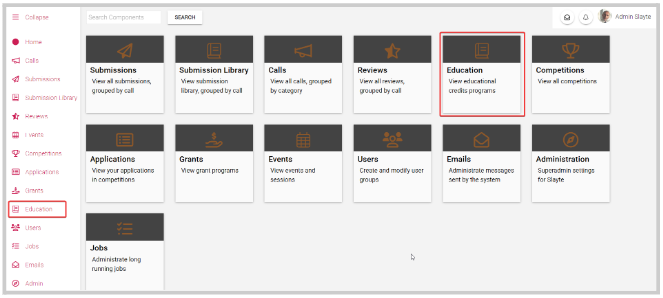
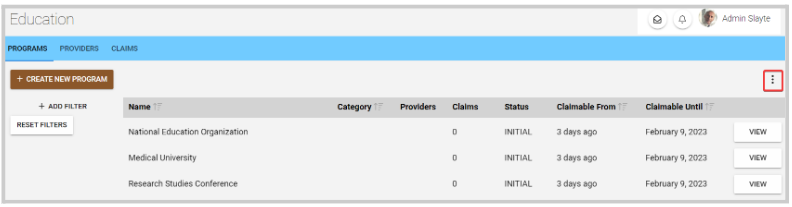

import { shareArticle } from '../../../components/share.js';
import { FaLink } from 'react-icons/fa';
import { ToastContainer, toast } from 'react-toastify';
import 'react-toastify/dist/ReactToastify.css';

export const ClickableTitle = ({ children }) => (
    <h1 style={{ display: 'flex', alignItems: 'center', cursor: 'pointer' }} onClick={() => shareArticle()}>
        {children} 
        <FaLink size="0.6em" />
    </h1>
);

<ToastContainer />

<ClickableTitle>Export Education Programs</ClickableTitle>

1. From Home click the **Education** tile, or from the left panel click **Education**

2. Click the **ellipsis button** on the right top corner

  
3. Select **Export List of Programs**. This export will generate a CSV of the programs currently shown in the table and deliver it to your account email.  
4. Click **Confirm**

/*/*Note: if you only required specific programs to be exported, you can filter them first to export only the filtered list. You can find more information [here](https://docs-for-customers.slayte.com/hc/en-us/articles/13018921004563) on how to filter programs 

