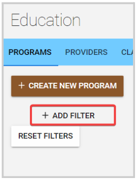
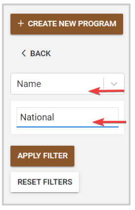
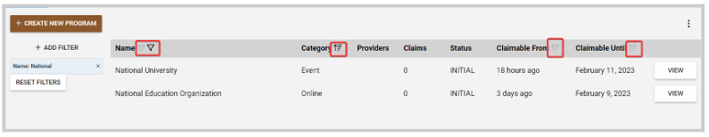
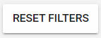

import { shareArticle } from '../../../components/share.js';
import { FaLink } from 'react-icons/fa';
import { ToastContainer, toast } from 'react-toastify';
import 'react-toastify/dist/ReactToastify.css';

export const ClickableTitle = ({ children }) => (
    <h1 style={{ display: 'flex', alignItems: 'center', cursor: 'pointer' }} onClick={() => shareArticle()}>
        {children} 
        <FaLink size="0.6em" />
    </h1>
);

<ToastContainer />

<ClickableTitle>Filter Education Programs</ClickableTitle>

1. From Home click the **Education** tile, or from the left panel click **Education**

2. Click **+ Add Filter** 

3. From the drop-down menu, select your filter criteria: Name, Providers, Start-Date, Deadline, or Status

4. Based on the selected criteria, type either name, date, or status to use to filter 

5. Click **Apply Filter**

/*/*Note: Additionally, you can sort them alphabetically (descendent-ascendent) by Name and category, or by date (older-newer) by Claimable From and Claimable Until. To do so, click the sort icon next to the desired column name 

6. When the filter is no longer needed, click **Reset Filters**

