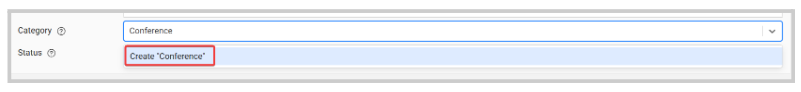

import { shareArticle } from '../../../components/share.js';
import { FaLink } from 'react-icons/fa';
import { ToastContainer, toast } from 'react-toastify';
import 'react-toastify/dist/ReactToastify.css';

export const ClickableTitle = ({ children }) => (
    <h1 style={{ display: 'flex', alignItems: 'center', cursor: 'pointer' }} onClick={() => shareArticle()}>
        {children} 
        <FaLink size="0.6em" />
    </h1>
);

<ToastContainer />

<ClickableTitle>How to Create a Program Category</ClickableTitle>

1. Go to **Education**, locate the desired program, and click **View**   
2. From the **About** section, click **Edit**   
3. Click the **Category** field, and type the name of the category you would like to create and click **Create** or **press enter** 

4. Click **Save**

/*/*Note: once a category has been assigned it cannot be removed, only change to a different/new category. 

