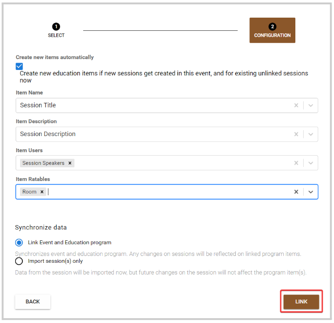

import { shareArticle } from '../../../components/share.js';
import { FaLink } from 'react-icons/fa';
import { ToastContainer, toast } from 'react-toastify';
import 'react-toastify/dist/ReactToastify.css';

export const ClickableTitle = ({ children }) => (
    <h1 style={{ display: 'flex', alignItems: 'center', cursor: 'pointer' }} onClick={() => shareArticle()}>
        {children} 
        <FaLink size="0.6em" />
    </h1>
);

<ToastContainer />

<ClickableTitle>Import Event Sessions as Claimable Items</ClickableTitle>

You can import some or all sessions from an event into your Education Program to be used as claimable items. Find the steps below: 

1. Go to **Educations**, and click the **Claimable Items** tab 

2. Click the **ellipsis** **button** to the right, and select **Import Sessions**

3. Search by name of the event you are importing from

4. Select the **session/sessions** that apply. To easily locate the sessions to use, you can search **name** or filter them by **Categories**

5. Fill in the session mapping, and click **Link**

Once added, you can **Edit** the item by including **Credits** and **External ID** (Optional). Also, you can unlink the item from the session, keep in mind If you unlink, the current Item will not be affected, but future changes in the Session will not be applied. When unlinked, you can then change the **Name**, **Description,** and **Date**

