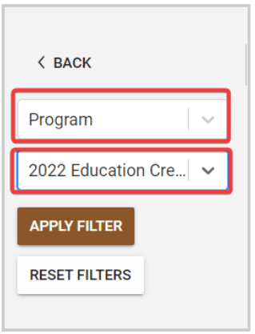
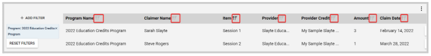
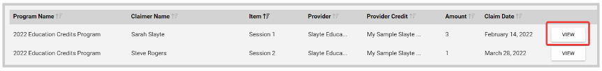
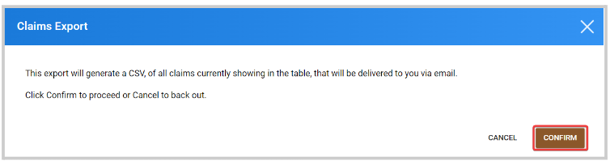
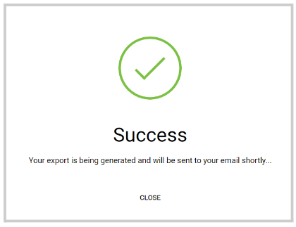

import { shareArticle } from '../../../components/share.js';
import { FaLink } from 'react-icons/fa';
import { ToastContainer, toast } from 'react-toastify';
import 'react-toastify/dist/ReactToastify.css';

export const ClickableTitle = ({ children }) => (
    <h1 style={{ display: 'flex', alignItems: 'center', cursor: 'pointer' }} onClick={() => shareArticle()}>
        {children} 
        <FaLink size="0.6em" />
    </h1>
);

<ToastContainer />

<ClickableTitle>Manage Claims</ClickableTitle>

As an Administrator, you have access to view and export all claims made for all programs to help you keep track or reporting purposes. 

1. From **Home**, click the **Education tile** or click the **Education** tab from the left panel   
2. Click the **Claims** tab on the top   
3. Here you will find all claims for all programs. You can filter these claims by **Item, Program, Claimer, Credit,** and **Claim date**. Click **+ Add Filter**, and set the criteria to use.

  
4. Click **Apply Filter**

Additionally to filtering, you can also sort the claims (ascendant - descendant and vice-versa) by **Program Name, Claimer Name, Item, Provider, Provider Credit, Amount,** and **Claim Date** by clicking the **sort button** 

To view the claim details, click the **View** button to the right of each claim 

You can also **Export** the filtered claims or all if needed; by clicking the **ellipsis button** on the right top corner. From there, select **Export All**, and from the pop-up window click **Confirm**

The Export will be sent to your email and attached as a .CSV file.

