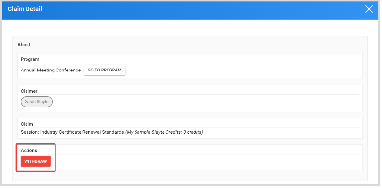
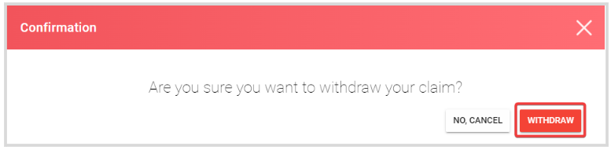
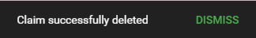

import { shareArticle } from '../../../components/share.js';
import { FaLink } from 'react-icons/fa';
import { ToastContainer, toast } from 'react-toastify';
import 'react-toastify/dist/ReactToastify.css';

export const ClickableTitle = ({ children }) => (
    <h1 style={{ display: 'flex', alignItems: 'center', cursor: 'pointer' }} onClick={() => shareArticle()}>
        {children} 
        <FaLink size="0.6em" />
    </h1>
);

<ToastContainer />

<ClickableTitle>Withdraw a User's Claim</ClickableTitle>

As an Administrator, you can remove/delete a successfully received claim for any program or any user when required. This change is effective immediately and cannot be undone, then the user will be able to re-submit a new claim for the same program. 

1.  Go to **Education**, and click the **Claims** tab from the top bar 

2. To easily locate a specific claim, you can filter them by **Item, Program, Claimer, Credit, and Claim Date.**

3. Once the claim has been located, click **View**

4. On the Claim Detail page, locate the **Actions** section and click **Withdraw**

****

5. From the pop-up confirmation window, click **Withdraw**

6. You will receive the following message once done

