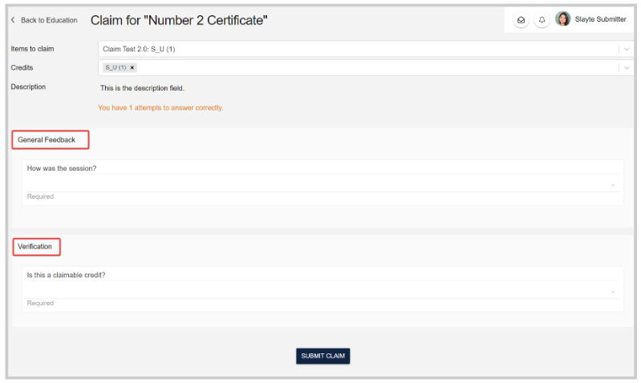

import { shareArticle } from '../../../components/share.js';
import { FaLink } from 'react-icons/fa';
import { ToastContainer, toast } from 'react-toastify';
import 'react-toastify/dist/ReactToastify.css';

export const ClickableTitle = ({ children }) => (
    <h1 style={{ display: 'flex', alignItems: 'center', cursor: 'pointer' }} onClick={() => shareArticle()}>
        {children} 
        <FaLink size="0.6em" />
    </h1>
);

<ToastContainer />

<ClickableTitle>Claim Credit(s) After Attending In-Person Session</ClickableTitle>

After you attended an event where your session attendance was recorded, you can claim credits for those sessions by following these steps: 

1. First, visit the claim program using the **link provided by the organizer**. After login, you will find a page similar to the one below:

2. Click on **Make Claim**

3. Select the **Item to claim,**from the drop-down menu to the right 

Note: If the same session is available under multiple credit providers, you can choose afterward which provider to select.

4. Fill in the claim, including General feedback for the session, speaker evaluations, or verification if required. 

5. Click **Submit Claim** at the bottom of the page. Afterward, you will see a confirmation like below:

6. Click on "Back to Program", to view all your claims and consider submitting to obtain your certificate. Alternatively, you can "Claim another session".

7. Request your certificate & Submit your completed claims and evaluations by clicking on **Submit Claimed Items.**

**/*/* NOTE:** Please do NOT submit your completed set of evaluations (Using the “SUBMIT CLAIMED SESSIONS”  button) until they are all complete so that your continuing education credit documentation includes all applicable credit hours. Once you submit your session evaluations to obtain your documentation (by clicking on the “SUBMIT CLAIMED SESSIONS” button), you cannot add additional session evaluations later for the same program.

8. You may be asked to confirm if you do not want to claim more credits, as you had been marked attended for more sessions than you submitted claims for. Consider submitting more claims before requesting your certificate. To proceed, click **I Confirm, Request Certificate**

Once requested, you will see a confirmation message like below:

## Get your certificate

Now that you have requested your certificate, you can get and download it. You may be required to fill in additional information for the certificate provider, e.g. your license number. To start this process, click on the **Certificates** tab.

1. Locate the program you want to get the certificate for, and click on the name tile 

**/*/*/* NOTE:** In the case of the tile as a lock image, then you have to fill in the provider's profile first (see steps below). Otherwise, you can directly get the certificate.

2. Fill in the provider profile (If required). If prompted, fill in the required information by the provider, "License Number" in the example below, and click **Save,**or via the **Providers** tab.

3. To complete the download, from the certificate tile; click in the pop window **I Confirm, Download Certificate** 

You will be prompted with a preview of the certificate, and from there you can download or print it. You'll also receive an email confirmation with a PDF of the certificate. 

