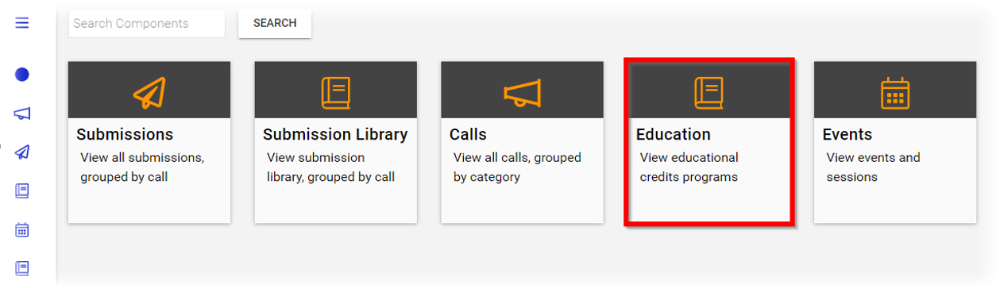
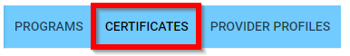
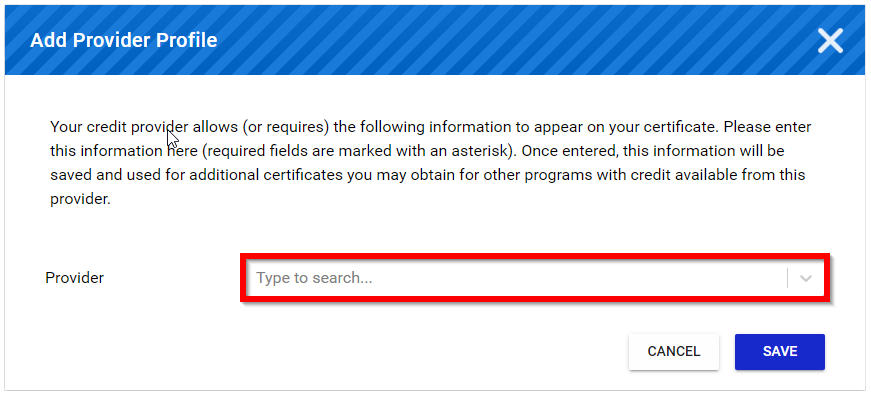
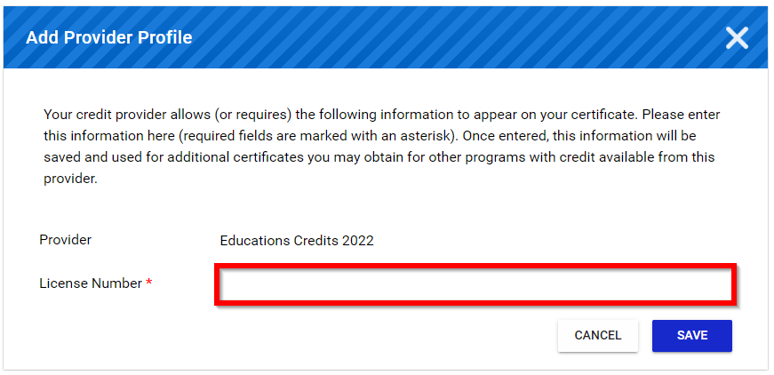
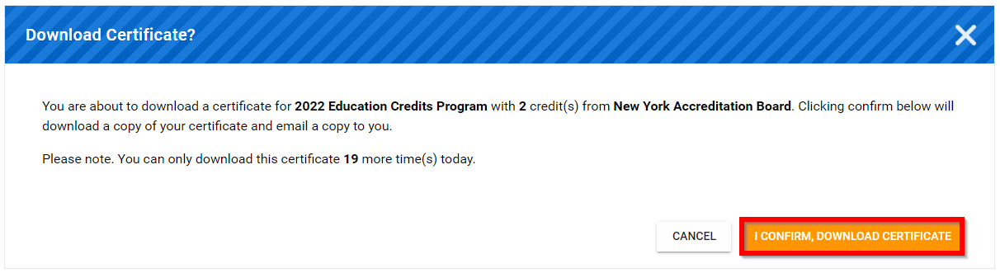

import { shareArticle } from '../../../components/share.js';
import { FaLink } from 'react-icons/fa';
import { ToastContainer, toast } from 'react-toastify';
import 'react-toastify/dist/ReactToastify.css';

export const ClickableTitle = ({ children }) => (
    <h1 style={{ display: 'flex', alignItems: 'center', cursor: 'pointer' }} onClick={() => shareArticle()}>
        {children} 
        <FaLink size="0.6em" />
    </h1>
);

<ToastContainer />

<ClickableTitle>Finalize Claim & Get Certificate</ClickableTitle>

1. From the Home page select **Education**

2. Select **CERTIFICATES**

3. Select the *desired* **certificate** 

4. Select **Provider** from the drop down menu

5. Type/Paste **License Number**

6. Select **SAVE** to continue

7. Select **I CONFIRM, DOWNLOAD CERTIFICATE**

8. Select **download/print** from the PDF

