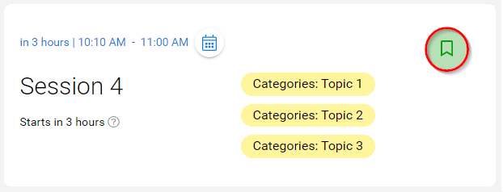
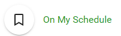
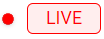
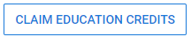

import { shareArticle } from '../../../components/share.js';
import { FaLink } from 'react-icons/fa';
import { ToastContainer, toast } from 'react-toastify';
import 'react-toastify/dist/ReactToastify.css';

export const ClickableTitle = ({ children }) => (
    <h1 style={{ display: 'flex', alignItems: 'center', cursor: 'pointer' }} onClick={() => shareArticle()}>
        {children} 
        <FaLink size="0.6em" />
    </h1>
);

<ToastContainer />

<ClickableTitle>Join a Session & Claim Credits</ClickableTitle>

1. After you have selected the desired session from the event add session to **My Schedule** by clicking on the **green bookmark icon**

****

2. The session will be added to your scheduled sessions located in **My Schedule** 

3. The session will start automatically to allow you to participate virtually

4. After the session is over select [**CLAIM EDUCATION CREDITS**](https://docs-for-customers.slayte.com/hc/en-us/articles/4575758269843)

Please note, you only need to add a session to your schedule once.

