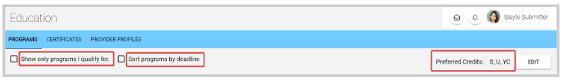
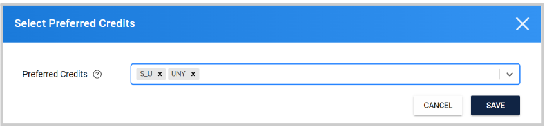
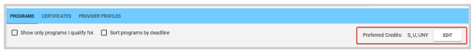

import { shareArticle } from '../../../components/share.js';
import { FaLink } from 'react-icons/fa';
import { ToastContainer, toast } from 'react-toastify';
import 'react-toastify/dist/ReactToastify.css';

export const ClickableTitle = ({ children }) => (
    <h1 style={{ display: 'flex', alignItems: 'center', cursor: 'pointer' }} onClick={() => shareArticle()}>
        {children} 
        <FaLink size="0.6em" />
    </h1>
);

<ToastContainer />

<ClickableTitle>Organize your Education Programs</ClickableTitle>

You can sort/filter your education programs based on your needs or preferences, either by Only programs I qualify for, Deadline, or Preferred Credits.

## **Show only programs I qualify for**

Active programs that you qualify for or meet the criteria (for example attendance to certain webinar/event, being part of a specific group, etc.), and still have available claims.

## **Sort programs by deadline**

Will display programs soon to reach the deadline first and oldest last.

## **Preferred Credit**

You can select specific providers to only display programs from them. You can select one or as many as desired. 

From the right top corner, you can confirm or edit your current view 

