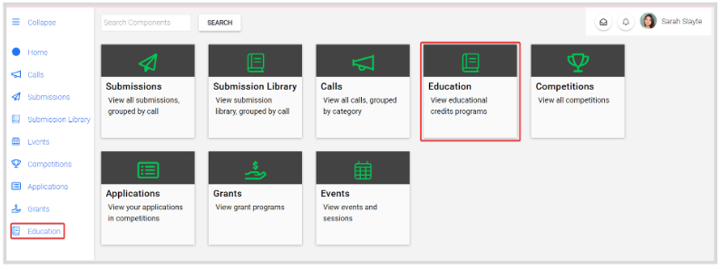
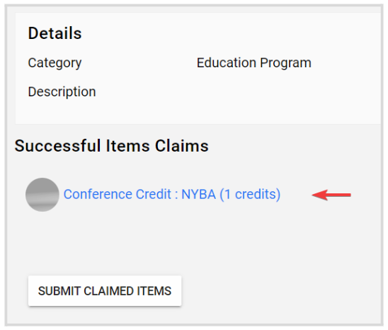
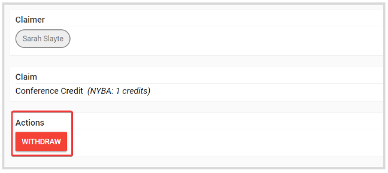
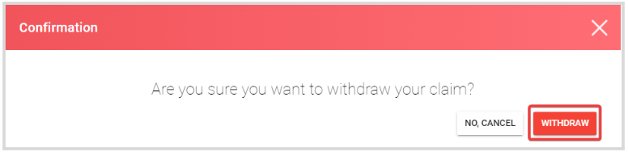
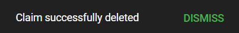
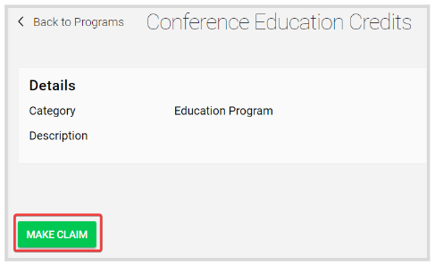

import { shareArticle } from '../../../components/share.js';
import { FaLink } from 'react-icons/fa';
import { ToastContainer, toast } from 'react-toastify';
import 'react-toastify/dist/ReactToastify.css';

export const ClickableTitle = ({ children }) => (
    <h1 style={{ display: 'flex', alignItems: 'center', cursor: 'pointer' }} onClick={() => shareArticle()}>
        {children} 
        <FaLink size="0.6em" />
    </h1>
);

<ToastContainer />

<ClickableTitle>Withdraw your Claim</ClickableTitle>

1. From the Home page, go to Education 

2. Click the **Program tile** holding the **Claim** to withdraw

3. On the **Successful Items Claims** section, click the claim link 

4. On the program detail page, locate the **Actions** section and click **Withdraw**

****

5. From the pop-up window, click **Withdraw**

6. You will receive the following confirmation message once done 

7. This change is effective immediately and cannot be undone. You will be able to submit a new Claim again. 

