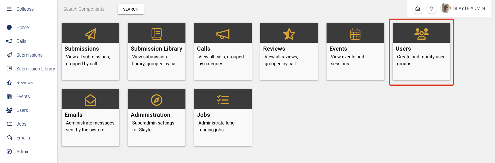
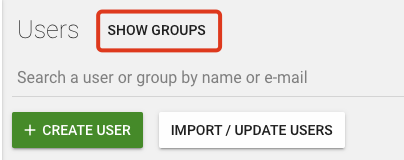
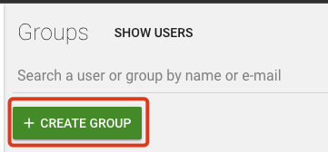
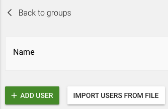

import { shareArticle } from '../../../components/share.js';
import { FaLink } from 'react-icons/fa';
import { ToastContainer, toast } from 'react-toastify';
import 'react-toastify/dist/ReactToastify.css';

export const ClickableTitle = ({ children }) => (
    <h1 style={{ display: 'flex', alignItems: 'center', cursor: 'pointer' }} onClick={() => shareArticle()}>
        {children} 
        <FaLink size="0.6em" />
    </h1>
);

<ToastContainer />

<ClickableTitle>Adding a New User Group in Slayte</ClickableTitle>

In this article, we will guide you on how to create a new user group in Slayte. Creating user groups can be particularly beneficial when managing review assignments. User groups can streamline these processes and enhance the overall management of assigments.

Here are the step-by-step instructions:

 

## Step 1: Navigate to “Users”

From your Slayte home page, find and click on the “Users” option.

## Step 2: Click on “Show Groups”

Once you are on the “Users” page, locate and click on the “Show Groups” option, which is typically found in the top-left corner of the screen.

## Step 3: Create a New Group

Next, click on “Create Group”. This will prompt a new dialogue box where you will be able to name and define the purpose of your new group.

## Step 4: Provide Group Details

In the prompted dialogue box, provide a meaningful name for your group that reflects its role or purpose. Once you've filled in these details, click on “Create” to finalize the creation of your new group.

 

## Step 5: Add Users to the Group

Finally, it's time to add users to your newly created group. Click on “Add User” to add individual users to the group. If you have a list of multiple users you'd like to add, you can choose the “Import Users from file” option. This feature allows you to upload a file containing the details of the users you'd like to add, which can significantly speed up the process if you're adding many users at once.

 

