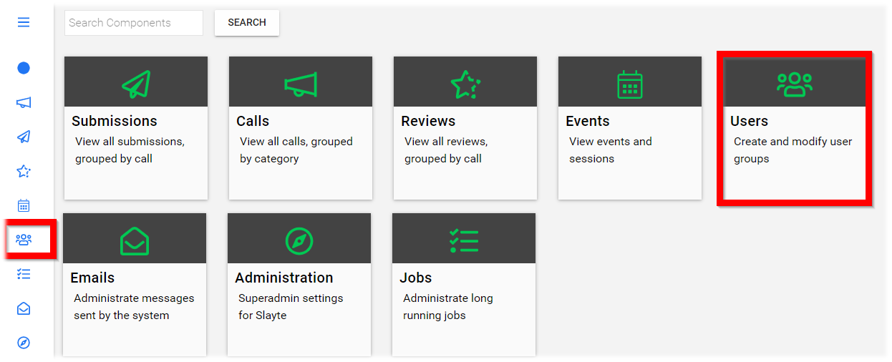
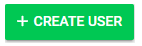
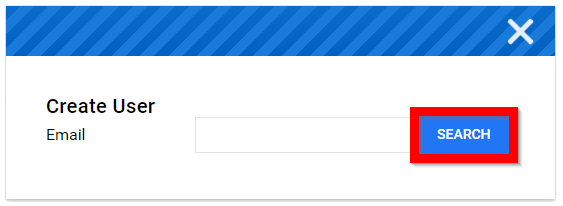
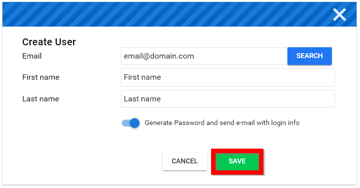

import { shareArticle } from '../../../components/share.js';
import { FaLink } from 'react-icons/fa';
import { ToastContainer, toast } from 'react-toastify';
import 'react-toastify/dist/ReactToastify.css';

export const ClickableTitle = ({ children }) => (
    <h1 style={{ display: 'flex', alignItems: 'center', cursor: 'pointer' }} onClick={() => shareArticle()}>
        {children} 
        <FaLink size="0.6em" />
    </h1>
);

<ToastContainer />

<ClickableTitle>Create User(s)</ClickableTitle>

1. From the Home page select **Users** either from the left menu or the Users tile

2. Select **CREATE USER**

3. Type in email address of user then select **Search** to ensure user is not already in the platform

4. Fill in **First** and **Last name** field 

5. Recommended to enable **Generate Password and send email with login credentials**

6. Select **SAVE**

7. You will be redirected to their profile page to edit, if needed 

 

