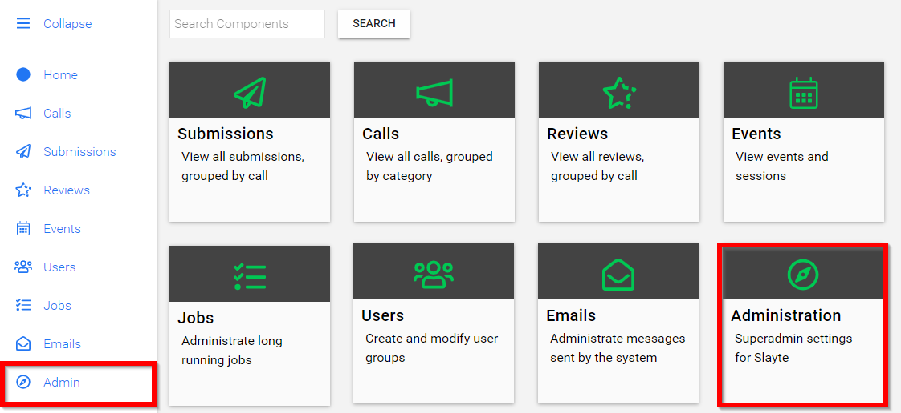
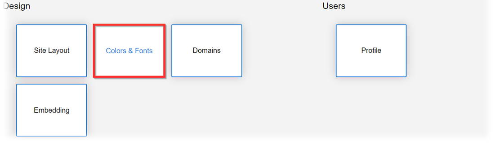
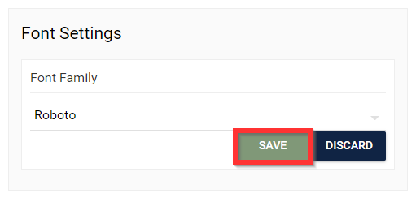
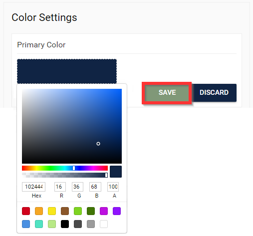
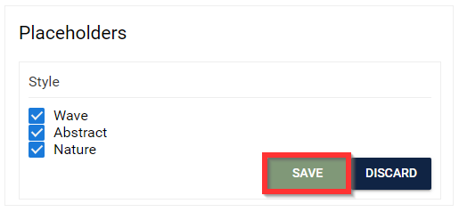

import { shareArticle } from '../../../components/share.js';
import { FaLink } from 'react-icons/fa';
import { ToastContainer, toast } from 'react-toastify';
import 'react-toastify/dist/ReactToastify.css';

export const ClickableTitle = ({ children }) => (
    <h1 style={{ display: 'flex', alignItems: 'center', cursor: 'pointer' }} onClick={() => shareArticle()}>
        {children} 
        <FaLink size="0.6em" />
    </h1>
);

<ToastContainer />

<ClickableTitle>Design - Colors & Fonts</ClickableTitle>

1. From the Home page select **Administration**

2. Under Design select **Color & Fonts**

3. You will be redirected to configure the following:

* **Font** Settings
	+ Select the **EDIT** button to choose the font form the dropdown menu:
		- Arial
		- Helvetica
		- Roboto
		- Times
		- Times New Roman
		- Verdana

* **Color** Settings - This will determine the colors used on the text and buttons
	+ Select the **EDIT** button to choose the **Primary Color** by selecting the color or enter in HEX
		- Please note, this setting will change the color of the menu and buttons.
	+ Select the **EDIT** button to choose the **Accent Color** by selecting the color or enter in HEX
		- Please note, this setting will change the color of the menu when in use or hovering over menu item.

* **Placeholder** Settings - This will determine the look and feel for calls/tiles and more.
	+ **Style** - This will determine the style/texture of tiles
		- Select the **EDIT** button to to enable the style/texture, choose one or a combination of:
			* Wave
			* Abstract
			* Nature
	+ **Colors** - This will determine the colors used on tiles  
	
		- Select the **EDIT** button to choose the desired **color** or enter in HEX
			* Please note, you are not limited to ONE color.

4.  Please ensure that **SAVE** is selected to complete changes

