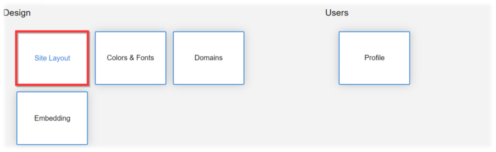
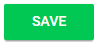

import { shareArticle } from '../../../components/share.js';
import { FaLink } from 'react-icons/fa';
import { ToastContainer, toast } from 'react-toastify';
import 'react-toastify/dist/ReactToastify.css';

export const ClickableTitle = ({ children }) => (
    <h1 style={{ display: 'flex', alignItems: 'center', cursor: 'pointer' }} onClick={() => shareArticle()}>
        {children} 
        <FaLink size="0.6em" />
    </h1>
);

<ToastContainer />

<ClickableTitle>Design - Site Layout</ClickableTitle>

1. From the Home page select **Administration**

2. Under Design select **Site Layout**

3. You will be redirected to configure the landing page and more:

* Set **logo**
	+ Select the SET LOGO button to drop/upload logo
* Set **logo height**
	+ Use the plus/minus to change the height of the logo as percentage in relation to page height
* Name **headline**
	+ Type in the name of company or incising headline
* Add **company description**
	+ Describe your brand, and what types of programs submitters can submit to
* Display/hide **calls**
	+ Enable/disable calls from being displayed on the landing page
* Customize **tab name** for web browser
	+ Type in Page tile
* Enable/disable **concise style**
	+ Select the checkbox to enable concise style will compress the layout of the Submission Form and reduce overall spacing

4. Select **SAVE** when finished

